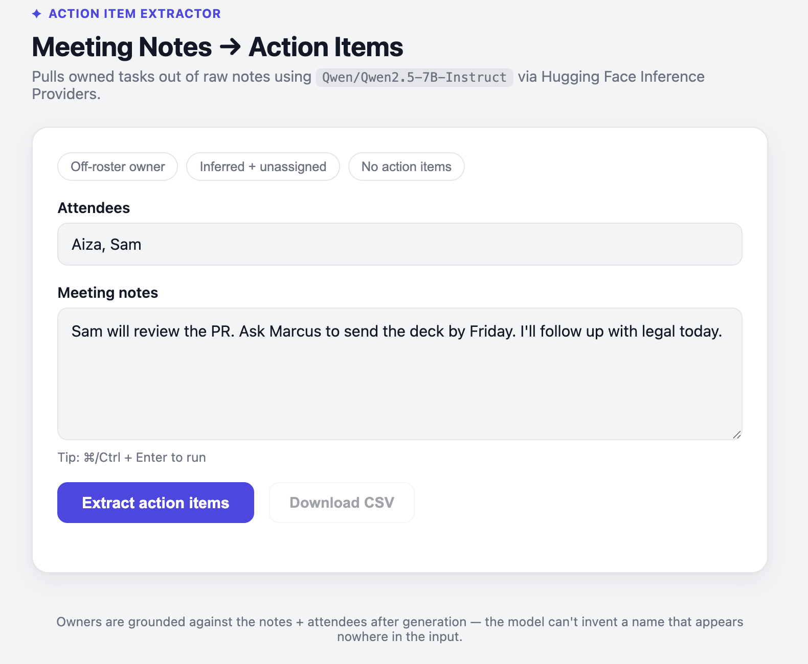

# Meeting Notes → Action Items

Turn messy, raw meeting notes into a clean list of action items — task, owner,
due date, and how confident we are about the owner — using a real AI
**agent** (built with `smolagents`, Hugging Face's agent framework, not just
a single model call), with a safety check that stops it from inventing people
who were never mentioned.

By default it runs on **Groq's free tier** (fast, no cost, generous limits).
It can also run fully offline on-device via **MLX** (Apple Silicon, free, no
account needed, lower quality), or on a **Hugging Face**-hosted model. See
[§7](#7-how-to-run-it-yourself) for how to switch.

This README explains **everything**, from scratch: what the project does, what
tools it's built with, how every file fits together, and what happens
step-by-step when you use it.



---

## 1. What problem does this solve?

Meetings produce messy notes like:

> "Sam will review the PR. Ask Marcus to send the deck by Friday. I'll follow
> up with legal today."

Buried in there are real to-dos, owners, and deadlines. Pulling that out by
hand is boring and easy to get wrong. This project automates exactly that one
step:

```
raw notes + attendee names  →  { task, owner, due date, confidence }[]
```

## 2. The one idea this project is built around

You can ask an AI model to always answer in a fixed shape — e.g. "always give
me `{task, owner, due, confidence}`". That's called a **schema**, and it's
easy to enforce.

What you **can't** enforce with a schema is *which names are real*. The agent
could confidently write `"owner": "John"` even if no John was ever mentioned
in this specific meeting — a hallucination. The list of real names (the
attendees, plus anyone named in the notes) is different every single time you
run this, so it can't be baked into a fixed schema ahead of time.

So the rule "don't invent an owner" has to be enforced in **three** places,
each catching what the one before it might miss:

1. **In the prompt** — politely instructing the agent not to invent names.
2. **As a tool the agent can call mid-reasoning** — `verify_owner` (see
   `action_items/tools.py`) lets the agent check a candidate name against
   the actual notes/attendees *before* committing to it, instead of only
   finding out afterward that it guessed wrong.
3. **In plain code, after the agent answers** — a dumb, reliable check
   (`action_items/validate.py`) that looks at the actual words in the
   notes/attendees and refuses to trust any owner name that doesn't really
   appear there, whether or not the agent bothered to check itself.

Step 3 is the part that makes this trustworthy instead of "probably fine."
An agent can choose not to call a tool, or call it and ignore the result —
prompts and tools are requests; the code check in step 3 is the guarantee.

## 3. What's actually used here (the tech stack)

| Piece | What it is | Why it's here |
|---|---|---|
| **Python (3.10+)** | Programming language | Everything is written in it; `smolagents` requires 3.10 or newer |
| **Pydantic** | A Python library for defining data "shapes" (schemas) | Forces the agent's final JSON answer into a strict, typed structure |
| **`smolagents`** | Hugging Face's agent framework | Runs the actual reasoning loop: a `ToolCallingAgent` that can call tools before giving its final answer |
| **Groq** (default) | A very fast, free-tier LLM hosting service | Runs `openai/gpt-oss-120b`, a large enough model to follow tool-calling instructions reliably, for free |
| **MLX** (optional) | Apple's on-device ML framework | Lets the agent run entirely offline on Apple Silicon, no account or token needed — see the note on model size in §7 |
| **Hugging Face `huggingface_hub`** (optional) | Python client for calling AI models hosted by Hugging Face | An alternate backend, if you'd rather use HF's hosted Qwen2.5-7B-Instruct and have Inference Providers credits |
| **Flask** | A small Python web server framework | Serves the web page and handles the "Extract" button's request |
| **HTML / CSS / JavaScript** | The web page itself | What you actually see and click in the browser |
| **pytest** | Python testing tool | Runs automated checks on the safety-net logic, without needing to run the real agent every time |

## 4. Project layout

```
meeting-notes-agent/
├── action_items/
│   ├── schema.py     ← defines the exact shape of a valid answer
│   ├── prompt.py      ← the instructions + examples given to the agent
│   ├── tools.py        ← the verify_owner tool the agent can call mid-reasoning
│   ├── agent.py          ← builds and runs the smolagents ToolCallingAgent
│   ├── validate.py         ← the safety-net check (catches invented owners)
│   ├── pipeline.py           ← glues agent + validate together
│   └── cli.py                  ← run everything from a terminal
├── webapp.py               ← the Flask web server
├── templates/
│   └── index.html           ← the web page (form + results + JavaScript)
├── tests/
│   └── test_action_items.py  ← automated tests for the safety-net logic
└── requirements.txt            ← list of Python packages this needs
```

## 5. What every file actually does, in plain words

### `action_items/schema.py` — the "form template"
Defines two shapes using Pydantic:
- `Action`: one task — its text, its owner (or nothing), a due date (must be
  one of `today` / `this_week` / `this_month` / `unspecified` — nothing else
  is allowed), and a confidence label (`explicit` or `inferred`).
- `Output`: a list of `Action`s, plus a separate list of `unassigned` tasks
  (tasks nobody could be confidently tied to).

If the agent's answer doesn't fit this shape, Pydantic raises an error
instead of silently accepting garbage.

### `action_items/prompt.py` — the instructions for the agent
Plain English text given to the agent as its task, before your notes. It
explains:
- that it has a `verify_owner` tool and should use it on any name it isn't
  already sure about,
- the exact JSON shape expected in its final answer,
- that an owner can be someone **not** in the attendee list, as long as
  they're actually named in the notes,
- that owners must **never** be invented,
- what `explicit` vs `inferred` confidence means,
- two worked examples showing correct input → output.

This is the file you'd tweak first if the agent's answers need to change.

### `action_items/tools.py` — the agent's self-check tool
Defines `build_verify_owner_tool(notes, attendees)`, which builds a fresh
`smolagents` tool for each request (it has to be request-specific — it closes
over *that* request's notes and attendees, since the set of real names is
different every time). The tool, `verify_owner(name)`, reuses the exact same
word-matching rule as `validate.py`, so the agent can check a name for itself
mid-reasoning and get the same answer the post-hoc safety net would give.

### `action_items/agent.py` — running the agent
Three interchangeable "runner" classes, one per backend, all implementing the
same `AgentRunner` protocol (`.run(notes, attendees) -> str`) so the rest of
the app doesn't care which one is in use:
- `GroqAgentRunner` (default) — a `smolagents` `OpenAIServerModel` pointed at
  Groq's OpenAI-compatible endpoint, running `openai/gpt-oss-120b`.
- `LocalAgentRunner` — a `smolagents` `MLXModel` running a small model
  on-device (Apple Silicon only). No token, but noticeably lower answer
  quality at a size that fits in 8GB of RAM — see the note in §7.
- `HFAgentRunner` — a `smolagents` `InferenceClientModel` pointed at a
  Hugging Face-hosted model (`Qwen/Qwen2.5-7B-Instruct` by default), for if
  you'd rather use HF credits instead.

All three build a `ToolCallingAgent` equipped with the `verify_owner` tool
around whichever model they wrap (see `_run_tool_calling_agent`), capped at 8
steps, and retry automatically if the model hits a transient generation
error (a busy provider, a malformed tool call) — small/free models don't
always get it right on the first try. `extract()` then takes the agent's raw
JSON string, parses it (tolerating minor formatting drift), and validates it
against the `Output` schema from `schema.py`, retrying the whole extraction
once more if that fails too.

### `action_items/validate.py` — the safety net
This is the part with no AI involved at all — just word matching:
1. Collect every word that appears in the notes and in the attendee list.
2. For every action the agent returned, check whether its owner's name is
   fully made up of words that actually appear there.
3. If yes → keep the action as-is.
4. If no (or there's no owner) → move that task into `unassigned` instead of
   keeping a possibly-invented name.

This is why the result can be trusted even if the agent hallucinates, or
skips calling `verify_owner` altogether: this step runs unconditionally and
catches it before you ever see it.

### `action_items/pipeline.py` — the glue
Two lines: call `extract()` (run the agent), then call `ground_output()`
(run the safety check), and return the final, cleaned result.

### `action_items/cli.py` — terminal version
Lets you run the whole thing from a terminal instead of a browser:
```bash
python3 -m action_items.cli notes.txt --attendees "Aiza,Sam"
```

### `webapp.py` — the web server
A small Flask app with two routes:
- `GET /` — serves the web page (`templates/index.html`).
- `POST /api/extract` — receives `{notes, attendees}` as JSON from the
  browser, runs the pipeline, and sends back the final result as JSON.

### `templates/index.html` — the web page
A single-file page with:
- an attendees field and a notes textarea,
- a few one-click example scenarios,
- an "Extract action items" button (with a loading spinner while the AI
  thinks),
- results rendered as cards (task, owner badge, due-date badge,
  confidence badge),
- an "Unassigned" section for anything without a trustworthy owner,
- a "Download CSV" button to export the results,
- a collapsible "View raw JSON" panel for the exact data underneath.

### `tests/test_action_items.py` — automated tests
These tests **don't** run the real agent (that would be slow and cost API
calls every time you test). Instead, they use a `FakeAgentRunner` that
returns a pre-written fake JSON answer, so the tests can focus purely on
checking that `validate.py` correctly:
- keeps an owner named in the notes even if they're not an attendee,
- demotes a hallucinated owner to `unassigned`,
- demotes a `null` owner to `unassigned`,
- rejects a partially-matching name like "Marcus Lee" when only "Marcus" was
  actually mentioned,

plus a direct test of `verify_owner` (from `tools.py`) confirming it agrees
with `validate.py` on the same cases.

## 6. End-to-end walkthrough with a real example

Say you open the web page, and type:

- **Attendees:** `Aiza, Sam`
- **Notes:** *"Sam will review the PR. Ask Marcus to send the deck by
  Friday."*

Then click **Extract action items**. Here's exactly what happens, in order:

1. **Browser → server.** The page's JavaScript sends
   `{"notes": "...", "attendees": "Aiza, Sam"}` to `webapp.py`'s
   `/api/extract` route, without reloading the page.
2. **Server → pipeline.** `webapp.py` calls
   `pipeline.run(notes, attendees, runner)`.
3. **Pipeline → agent.** `agent.py` builds a request-specific `verify_owner`
   tool, spins up a `ToolCallingAgent`, and gives it a task built from the
   system prompt (rules + examples) plus your specific notes and attendees.
4. **Agent reasons**, optionally calling `verify_owner("Marcus")` or
   `verify_owner("Priya")` to check a name before using it, then calls
   `final_answer` with something like:
   ```json
   {
     "actions": [
       {"task": "review the PR", "owner": "Sam", "due": "unspecified", "confidence": "explicit"},
       {"task": "send the deck", "owner": "Marcus", "due": "this_week", "confidence": "explicit"}
     ],
     "unassigned": []
   }
   ```
5. **Pipeline → safety check.** `validate.py` checks each owner again,
   independently of whatever the agent did:
   - "Sam" → appears in the attendee list. Kept.
   - "Marcus" → **not** an attendee, but *is* named directly in the notes.
     Still kept, because the rule is "must appear somewhere in the input,"
     not "must be an attendee."
   - (If the agent had instead said `"owner": "Priya"` — a name appearing
     nowhere — that task would be moved into `unassigned` here, whether or
     not the agent had called `verify_owner` on it first.)
6. **Server → browser.** The final JSON goes back to the page.
7. **Browser renders it** as two task cards with colored badges, plus a
   "Download CSV" option and a raw-JSON view.

## 7. How to run it yourself

### Install dependencies
Requires **Python 3.10+** (`smolagents` doesn't support older versions).
```bash
pip3 install -r requirements.txt
```

### Get a Groq API key (default backend, free)
1. Go to https://console.groq.com/keys and sign up (free, no card needed).
2. Create an API key.
3. Add it to your shell so you don't have to type it every time:
   ```bash
   echo 'export GROQ_API_KEY=gsk_your_key_here' >> ~/.zshrc
   source ~/.zshrc
   ```

### Run the automated tests (no agent calls, instant)
```bash
python3 -m pytest tests/ -v
```

### Run it in a browser
```bash
python3 webapp.py
```
Then open **http://127.0.0.1:7860**.

### Run it from a terminal instead
```bash
echo "Sam will review the PR by Friday." | python3 -m action_items.cli --attendees "Aiza,Sam"
```

### Using a different backend
Both the web app and the CLI default to Groq. To use something else:
```bash
# Fully offline, no token, Apple Silicon only (lower answer quality):
AGENT_BACKEND=local python3 webapp.py
echo "..." | python3 -m action_items.cli --backend local --attendees "Aiza,Sam"

# Hugging Face-hosted (needs HF_TOKEN with Inference Providers credits):
AGENT_BACKEND=hf python3 webapp.py
echo "..." | python3 -m action_items.cli --backend hf --attendees "Aiza,Sam"
```

> **Why not just run everything locally?** We tried a small on-device MLX
> model (3B parameters, sized to fit this machine's 8GB of RAM) first. It
> technically ran fully offline and never invented a fake owner — but its
> actual reading comprehension was too weak to trust: it set real, clearly-
> stated owners to `null`, and once even copied an unrelated task straight
> out of the prompt's own worked examples. A large enough model matters for
> more than just formatting — Groq's free tier gets you a genuinely capable
> model (120B parameters) without needing the RAM or GPU to run one that size
> yourself.

## 8. The one thing worth remembering

**A schema tells the agent what shape to answer in. It cannot tell the agent
which names are real, because that set of real names only exists once you
actually see this specific meeting's notes.** Giving the agent a tool to
check names for itself (`verify_owner`) helps, but a tool is still something
the agent chooses to use — not a guarantee. That's why the grounding check in
`validate.py` exists as ordinary, boring, reliable code — running
*unconditionally, after* the agent answers — instead of trusting the agent
to police itself.
